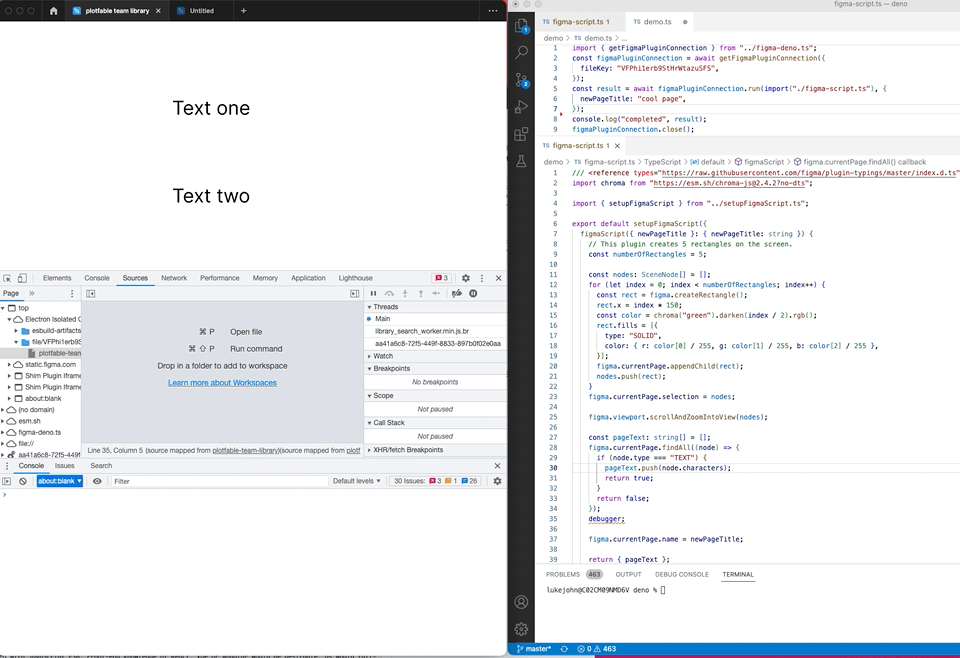

# Figma plugin for controlling figma from deno

Demo gifs.

**Demo One.**

Inserting into the current page, updating the current page name with some data from deno and returning some data from the figma page back to deno.



**Demo two.** Showing how you can use the [debugger](https://developer.mozilla.org/en-US/docs/Web/JavaScript/Reference/Statements/debugger) statement to inspect the script inside figma.


## Installation instructions

1. Clone this repository
2. Run `npm install` in the project root
3. In figma select the menu item Plugins > Development > Import plugin from manifest...
4. Select the manifest.json file from the cloned repo

## Usage instructions

Note: while you can start the plugin prior to the deno side -- it does not matter which one is started first. The Deno script will wait till the plugin is opened in a relevant file.

### Figma side

1. Navigate to a Figma file you want to control from deno.
2. Open the plugin

### Deno side

Create a plugin script. Note -- to use npm packages, import the file from a [deno compatible cdn](https://deno.land/manual@v1.17.2/npm_nodejs/cdns).

Also -- due to a bug in the code driving this -- if the package does not have types -- then you may need to add `?no-dts` if using esm.sh.

ie.

```ts
/// <reference types="https://raw.githubusercontent.com/figma/plugin-typings/master/index.d.ts" />
import chroma from "https://esm.sh/chroma-js@2.4.2?no-dts";

import { setupFigmaScript } from "https://raw.githubusercontent.com/luke-john/use-figma-plugin-api-from-deno/master/deno/setupFigmaScript.ts";

export default setupFigmaScript({
  figmaScript({ newPageTitle }: { newPageTitle: string }) {
    // This plugin creates 5 rectangles on the screen.
    const numberOfRectangles = 5;

    // This file holds the main code for the plugins. It has access to the *document*.
    // You can access browser APIs such as the network by creating a UI which contains
    // a full browser environment (see documentation).

    const nodes: SceneNode[] = [];
    for (let index = 0; index < numberOfRectangles; index++) {
      const rect = figma.createRectangle();
      rect.x = index * 150;
      const color = chroma("green")
        .darken(index / 2)
        .rgb();
      rect.fills = [
        {
          type: "SOLID",
          color: { r: color[0] / 255, g: color[1] / 255, b: color[2] / 255 },
        },
      ];
      figma.currentPage.appendChild(rect);
      nodes.push(rect);
    }
    figma.currentPage.selection = nodes;

    figma.viewport.scrollAndZoomIntoView(nodes);

    let pageText: string[] = [];
    figma.currentPage.findAll((node) => {
      if (node.type === "TEXT") {
        pageText.push(node.characters);
        return true;
      }
      return false;
    });

    figma.currentPage.name = newPageTitle;

    return { pageText };
  },
});
```

Create a "control" script

note: you will need to grap the file key from the plugin which will have this example code in its ui when opened.

```ts
import { getFigmaPluginConnection } from "https://raw.githubusercontent.com/luke-john/use-figma-plugin-api-from-deno/master/deno/figma-deno.ts";

const figmaPluginConnection = await getFigmaPluginConnection({
  fileKey: "your file key -- get this from the plugin ui",
});

const result = await figmaPluginConnection.run(import("./figma-script.ts"), {
  newPageTitle: "cool page",
});
console.log("completed", result);

figmaPluginConnection.close();
```
